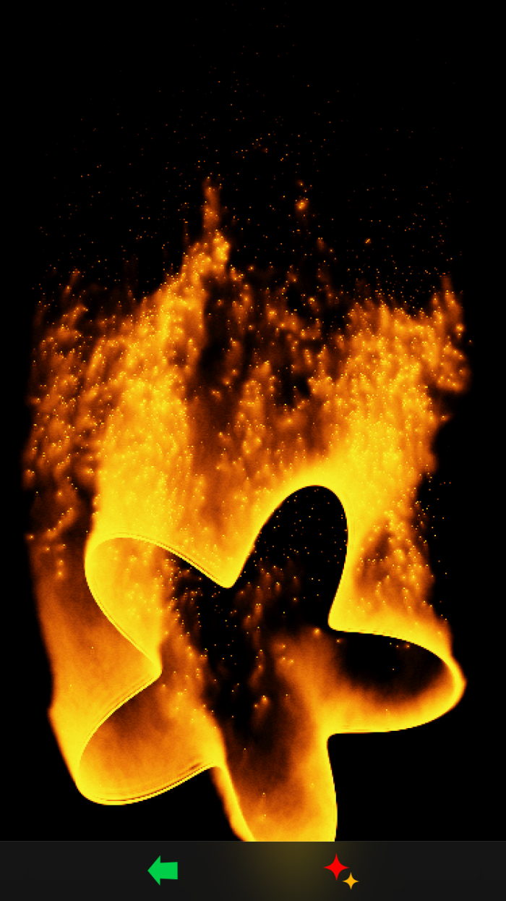
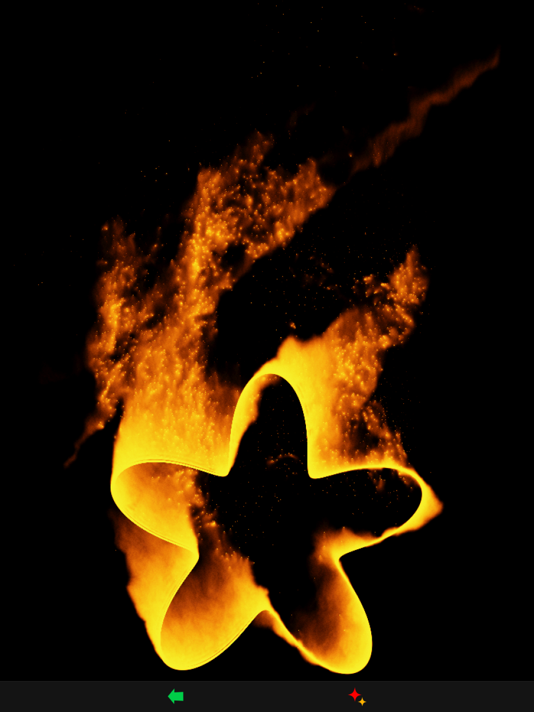

Realistic flame animation on GPU for iOS, written with Metal API

This is a small app utilizing the iPhone and iPad GPU capabilities.

There is a "play" mode, where you can play with fire, and a "create" mode, where you can create static pictures with added animated flame effects.

 
